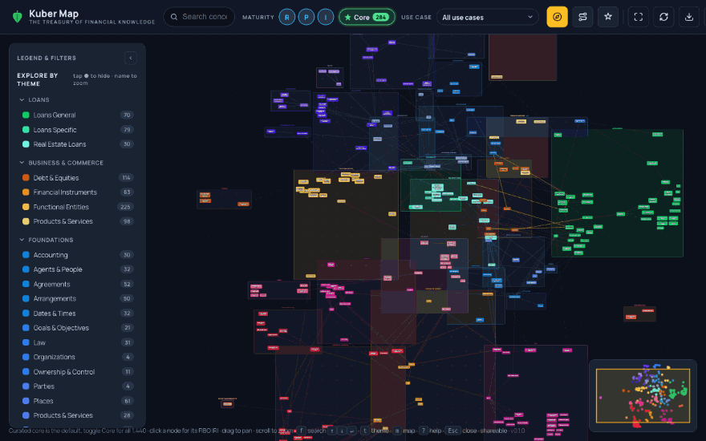
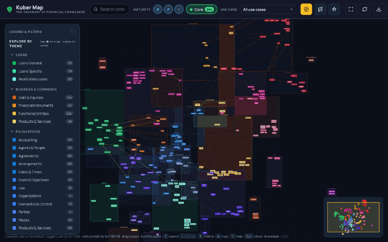
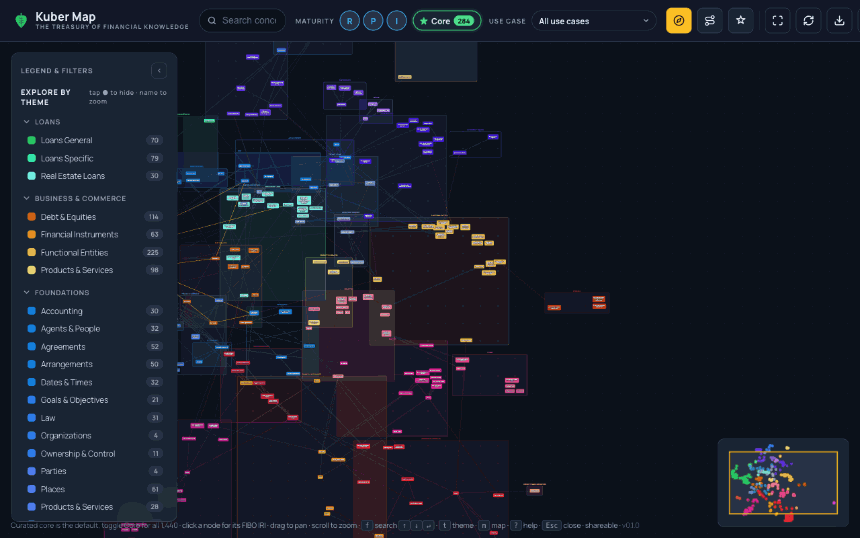
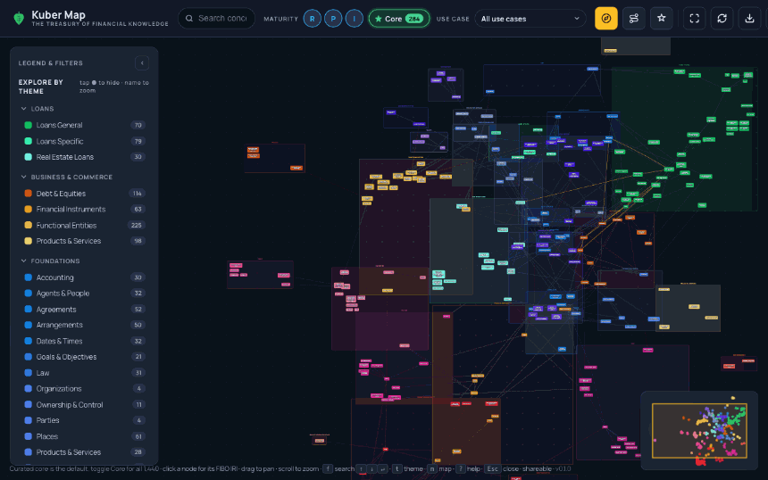
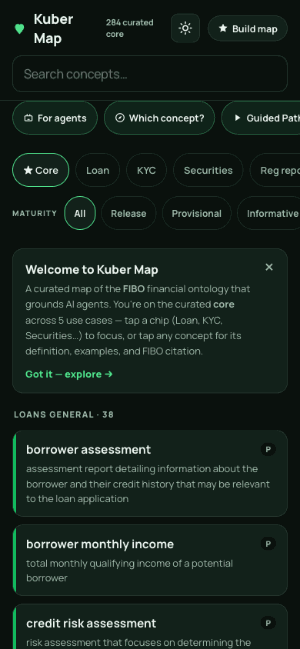
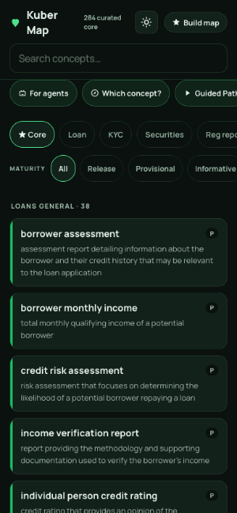

# Kuber Map · the treasury of financial knowledge

A curated, learner-first knowledge map of the **Financial Industry Business Ontology
([FIBO](https://github.com/edmcouncil/fibo))** that doubles as **audit-ready grounding for
financial AI agents**. Every concept carries its FIBO IRI as a citation; provenance (`fibo` vs
`curated`) is never blurred.

[](https://ai-first-community.github.io/kuber-map/)
[](https://github.com/AI-First-Community/kuber-map/actions/workflows/ci.yml)
[](LICENSE)
[](CONTRIBUTING.md)
[](https://github.com/AI-First-Community/kuber-map/wiki)

> **▶ Open the app: <https://ai-first-community.github.io/kuber-map/>** — a live, installable app,
> not a mockup: it runs in the browser, works offline, and installs as a PWA (desktop: address-bar
> install; mobile: Add to Home Screen, or scan the QR on the landing page). Nothing to sign up for,
> nothing to pay.

<p align="center">
  <a href="https://ai-first-community.github.io/kuber-map/"></a>
</p>

<details>
<summary><b>▶ More demos</b> — decision guide · guided path · compare · mobile app · grounding for agents</summary>
<br>

**Which concept?** — a decision guide from a plain need to the right FIBO class.
<p align="center"></p>

**Guided path** — a curated walkthrough of the loan-origination arc.
<p align="center"></p>

**Compare** — concepts side by side across FIBO's separately-governed domains.
<p align="center"></p>

**Mobile app** — the installable PWA: dark & light themes, provenance pills, FIBO citations, offline.
<p align="center"></p>

**Built for agents** — every use case exports a citable context pack; grounding is measured, not claimed.
<p align="center"></p>

</details>

Named for **Kubera**, the treasurer and god of wealth. Inspired by the
[Bodhi Map](https://github.com/AI-First-Community/Bodhi) approach: reveal how concepts *connect*,
not just what they mean.

---

## Why this exists

Every FinTech wants AI in production; few can trust it there. A large language model is *fluent but
not grounded* — it talks about a mortgage or a beneficial owner convincingly, but approximately, and
in finance approximately-right is wrong. Kuber Map gives AI the **precise, shared, auditable language
of the business**: the industry's own standard ontology (FIBO), made usable and packaged as grounding
context an agent can cite. The full thesis is in **[docs/Vision.md](docs/Vision.md)**.

FIBO is a formal, exhaustive ontology built for modelers. Kuber Map reshapes it into three things it
isn't today:

1. **A teachable map** — a hand-picked "core" view with learner-friendly framing, where every other
   FIBO explorer renders the whole thing exhaustively for experts.
2. **A cross-domain bridge layer** — provenance-tagged links across FIBO's separately-governed
   domains, offered back to the EDM Council.
3. **Agent grounding** — per-use-case context packs that give financial AI agents accurate semantics
   with a FIBO provenance trail for audit.

## The value, measured

Grounding is not a claim here — it is measured. The same agent answers the same benchmark **with** the
curated FIBO context pack vs **without** it, scored deterministically (no LLM judge):

| | Ungrounded | Grounded | across |
|---|---|---|---|
| **Accuracy** | 47.5% | **92.8%** (+45.3 pt) | 263 questions |
| **Auditable** (cites a real FIBO IRI) | 0% | **97.0%** | 5 use cases |
| **Hallucinated citations** | 55% | **0%** | gpt-4o-mini |

The lift is domain- and model-robust — a stronger model does **not** close the gap. Full write-up:
**[SPIKE_RESULTS.md](SPIKE_RESULTS.md)**.

## What's in the box

- **The map** — an interactive Cytoscape view (`index.html` landing, `app.html` desktop graph,
  `m.html` mobile app), all driven by one generated `js/data.js`. Ten FIBO domains + Commons
  (3,104 concepts, 6,676 relations), a curated **core of 284** across **5 use cases** (loan
  origination, KYC, securities, regulatory reporting, derivatives) with a use-case lens, and **19
  validated cross-domain bridges**.
- **Context packs** (`export/`) — each use case's grounding closure as `pack.json` (RAG),
  `context.md` (prompt injection), a self-contained OKF slice, plus a stdlib **MCP retrieval server**
  (`etl/mcp_server.py`). See the wiki [For AI Teams](https://github.com/AI-First-Community/kuber-map/wiki/For-AI-Teams).
- **The bridge contribution** (`contrib/`) — the 19 bridges packaged as an EDM Council proposal
  (methodology doc + RDF/Turtle).

> **A note on the edge counts.** You'll see three, describing the same graph at different stages: **6,676** typed relations extracted from FIBO, **6,687** edges in the interactive map (those + the 19 curated bridges + a few guided-tour path edges), and **6,896** frontmatter edges in the OKF bundle (including cross-cluster targets awaiting their domain).

## Quick start

```bash
make setup      # create venv, install deps
make fibo       # fetch the pinned FIBO source        -> fibo-source/
make commons    # fetch the Commons upper ontology     -> commons-source/
make all        # extract -> build OKF bundle -> validate
make map        # OKF bundle -> js/data.js for the map
make check      # quality gate: ruff + pytest + validate + attribution guard
```

The generated `knowledge/` bundle and `js/data.js` are committed, so **the map is browsable without
a rebuild** — just serve the folder over http (`python3 -m http.server`) and open `index.html`.
Requires Python 3.11+, Node (for the map build), and git. Full walkthroughs:
[Getting Started](https://github.com/AI-First-Community/kuber-map/wiki/Getting-Started) ·
[Architecture](https://github.com/AI-First-Community/kuber-map/wiki/Architecture) (with diagrams).

## Documentation

The **[wiki](https://github.com/AI-First-Community/kuber-map/wiki)** is the home for detail:
[Vision & Philosophy](https://github.com/AI-First-Community/kuber-map/wiki/Vision) ·
[Use Cases](https://github.com/AI-First-Community/kuber-map/wiki/Use-Cases) ·
[Authoring a Use Case](https://github.com/AI-First-Community/kuber-map/wiki/Use-Case-Authoring) ·
[For AI Teams](https://github.com/AI-First-Community/kuber-map/wiki/For-AI-Teams) ·
[Value Proof](https://github.com/AI-First-Community/kuber-map/wiki/Value-Proof) ·
[Cross-Domain Bridges](https://github.com/AI-First-Community/kuber-map/wiki/Cross-Domain-Bridges).

## Contributing

Contributions are welcome, and this project values **grounded, verifiable** work over speed. Good
first contributions:

- **Add a use case** — a curated slice for a real financial task. It's spec-driven (a JSON file
  under `curation/usecases/`), no code change; the tooling verifies every id against FIBO. Step by
  step: [Authoring a Use Case](https://github.com/AI-First-Community/kuber-map/wiki/Use-Case-Authoring).
- **Propose a cross-domain bridge** — a link FIBO doesn't draw, with a rationale + citation. The
  gate rejects any bridge that isn't grounded or that duplicates FIBO.
- **Improve the map or the mobile app** — UX, accessibility, performance (desktop and `m.html` are
  separate UIs over the same data).
- **Report a FIBO fidelity issue** — if the map misrepresents FIBO, cite the source IRI.

Read **[CONTRIBUTING.md](CONTRIBUTING.md)** and the **[Code of Conduct](CODE_OF_CONDUCT.md)** first.
Every PR must pass `make check` (CI runs it automatically), keep FIBO facts grounded in source (no
invented IRIs), and keep provenance (`fibo` vs `curated`) unblurred. Use the issue templates to file
bugs, use-case proposals, or fidelity reports.

## Repository layout

| Path | What |
|---|---|
| `etl/` | FIBO extraction → OKF pipeline + context-pack export + bridge export + MCP server (Python) |
| `knowledge/` | Generated OKF bundle (do not hand-edit) |
| `curation/` | Hand-authored overlays: use-case specs, core sets, bridges, definitions, examples, notes |
| `scripts/okf.js`, `okf.config.js`, `js/`, `*.html` | The map — desktop (`app.html`) + mobile (`m.html`) UIs |
| `export/` | Generated context packs (per use case) |
| `contrib/` | The cross-domain bridges packaged as an EDM Council proposal |
| `eval/` | Grounded-vs-ungrounded eval harness + benchmarks (5 use cases) |
| `tests/` | pytest quality gate |
| `docs/`, wiki | Documentation |
| `PLAN.md`, `BACKLOG.md`, `CLAUDE.md` | Plan, execution tracker, contributor rules |

## License

MIT © 2026 Sanjeev Azad — see [`LICENSE`](LICENSE).

This project incorporates and redistributes content from **FIBO** (MIT, © EDM Council & OMG) and the
**OMG Commons Ontology Library** (MIT, © EDM Council, OMG & Thematix Partners) — both permissive and
MIT-compatible — plus vendored MIT/OFL front-end libraries. Their copyright and permission notices,
and a trademark disclaimer, are in **[`THIRD_PARTY_NOTICES.md`](THIRD_PARTY_NOTICES.md)**. FIBO / EDM
Council / OMG are trademarks of their owners; this is an independent, community project, not affiliated
with or endorsed by them.
