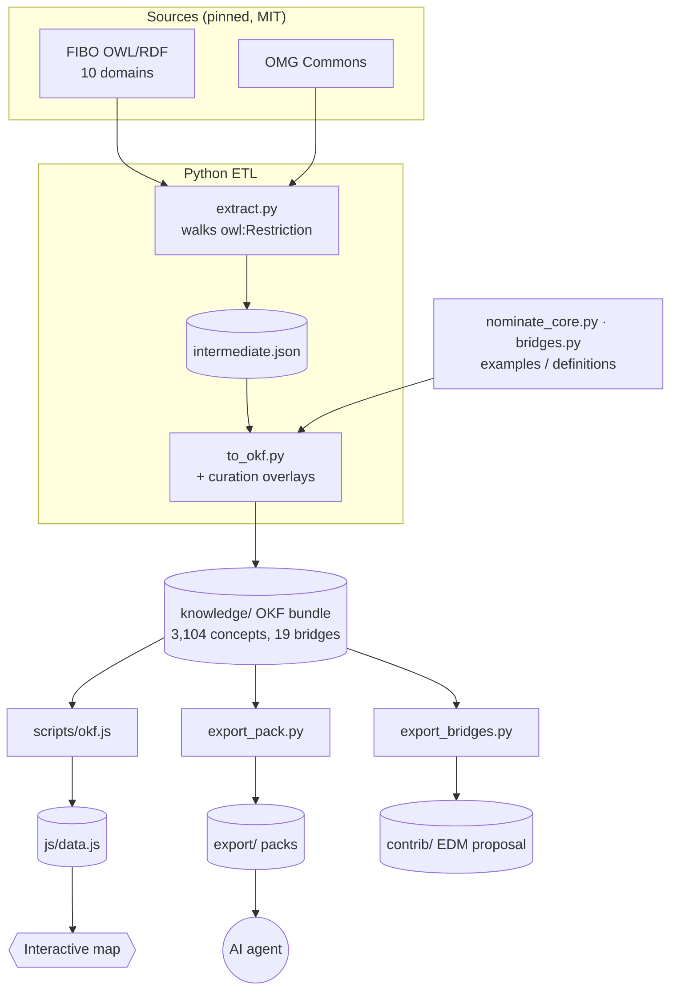
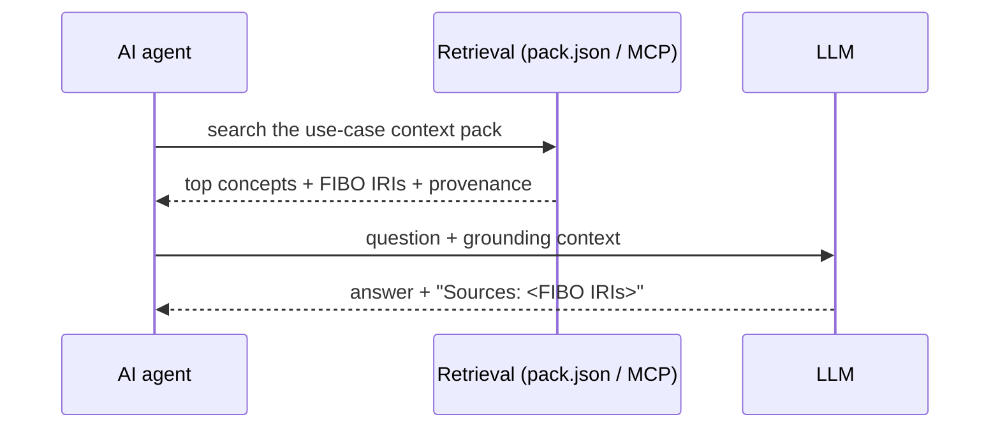
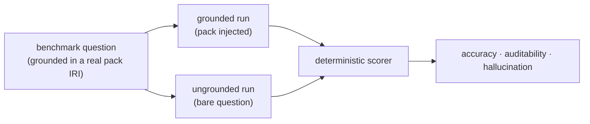

# Architecture

> Visual, navigable version with more flows: the wiki
> [Architecture](https://github.com/AI-First-Community/kuber-map/wiki/Architecture) page.

## The pipeline



Two toolchains, cleanly split (PLAN §5):

- **Python does the FIBO extraction** — the hard part, where relationships hide in
  `owl:Restriction` blank-node axioms rather than flat triples.
- **JavaScript does the browser build** — `scripts/okf.js` turns the OKF bundle into `js/data.js`
  for the Cytoscape map. The UI (`app.html`, `js/graph.js`, `css/style.css`) is forked from Bodhi
  and driven entirely by `okf.config.js` + `data.js`.

## Extraction (`etl/extract.py`)

- Parses every `.rdf` under the requested domains plus the Commons modules, merging into one
  graph. Blank nodes are remapped per file so anonymous restrictions never collide.
- For each class it pulls the label, definition, and **the typed relations buried in
  `owl:Restriction` axioms** on `rdfs:subClassOf` (e.g. `secured-by`, `has-party-role`), plus the
  richer annotations that feed the map's detail card: explanatory/usage notes, `skos:example`,
  and synonyms.
- **Deterministic:** labels/definitions prefer `en-US`; relations sort stably; maturity is taken
  from a class's label-bearing home file. `make all` reproduces the bundle byte-for-byte,
  independent of hash seed.
- `fibo_ns.py` classifies every IRI into a cluster (FIBO domain / `CMNS` / `LCC`) and maps it to a
  collision-free bundle path that mirrors FIBO's module structure.

## The OKF bundle (`knowledge/`)

One markdown file per concept, with YAML frontmatter:

```yaml
type: FIBO Class
title: "mortgage"
description: "grant of financial interest in real property ..."
resource: https://spec.edmcouncil.org/fibo/ontology/LOAN/.../Mortgage   # the audit citation
tags: [LOAN, Release]
core: true
detail: "A mortgage prevents transfer of ownership unless ..."
examples: ["A 30-year fixed-rate home loan", "An FHA-insured mortgage"]
relations:
  - {type: is-a, target: "/LOAN/.../SecuredLoan.md", provenance: fibo}
  - {type: reported-in, target: "/LOAN/.../HMDA-Report.md", provenance: curated}   # a bridge
```

`knowledge/` is **generated**: to change it, change the ETL or its curation inputs and rebuild.
Only `knowledge/bridges/` and the `curation/` overlays are hand-authored.

## Curation overlays (`curation/`)

Applied by `to_okf.py`, each grounded in real FIBO IRIs (resolved against the extract, so nothing
can reference a concept that doesn't exist):

| File | What it adds | Provenance |
|---|---|---|
| `curation/usecases/<uc>.json` | the facet spec for a use case (a grounded `[id, cluster]` list) | input |
| `curation/<uc>.json` | the resolved `core:` concepts for that use case (`nominate_core.py` output) | — |
| `curation/usecases/<uc>-bridges.json` | that use case's cross-domain bridges FIBO doesn't draw natively | `curated` |
| `<uc>-examples.json` / `-definitions.json` | worked examples + gap-filling definitions per use case | `curated` |
| `definitions.json` / `examples.json` / `notes.json` | the original loan-origination overlays | `curated` |

Five use cases are curated this way — **loan origination (71), KYC (58), securities (59),
regulatory reporting (52), derivatives (60)**: 284 `core:` concepts and **19 validated cross-domain
bridges** in total. Each concept records the use case(s) it belongs to (`use_cases:` frontmatter),
which drives the map's use-case lens. A use case is added by dropping a spec under
`curation/usecases/` — the tooling resolves and gates it, no code change.

**Provenance is never blurred.** Every edge and every overlaid field is tagged `fibo` (from FIBO)
or `curated` (authored here). Overlays only fill gaps; they never overwrite real FIBO text.
`etl/export_bridges.py` (`make contrib`) packages the 19 bridges as an EDM Council proposal
(`contrib/`): a methodology doc plus RDF/Turtle where each bridge is a proposed `kmb:` triple with
rationale + citation — no unverified FIBO properties are asserted.

## The map (`scripts/okf.js` + `okf.config.js` + `js/`)

- `okf.config.js` holds everything that isn't a concept: the FIBO domains (each split into its
  module **sub-clusters**, shaded within the domain hue), maturity levels, relation styling
  (curated bridges drawn distinctly), and the interactive flows (a decision guide, a guided tour,
  comparison tables), all referenced by FIBO IRI.
- `scripts/okf.js build` reads the bundle + config and emits `js/data.js`: nodes + typed,
  provenance-tagged edges, with the flow IRIs resolved to node ids.
- `js/graph.js` (forked from Bodhi, ~6 small edits) renders it with Cytoscape + fcose. `css` is
  byte-identical to Bodhi. The detail card surfaces each concept's definition, examples,
  provenance, and its **FIBO IRI citation**.

## The context pack (`etl/export_pack.py`)

Takes a use case's grounding closure (its `core:` concepts + bridges) and emits a portable pack:
`pack.json` (structured records for RAG), `context.md` (for direct prompt injection), a
self-contained `okf/` slice, and a README. `etl/retrieval.py` provides weighted keyword search
over the pack, exposed as an MCP retrieval endpoint by `etl/mcp_server.py`. Every result carries
the FIBO `citation` IRI and provenance, so an agent can cite exactly which concept justified an
answer and a regulator can trace it. At runtime:



## The eval (`eval/`)



`eval/harness.py` runs a financial-semantics agent over a benchmark **with** vs **without** the
context pack, scoring accuracy, hallucination, and auditability deterministically (no LLM judge).
The model is pluggable (`eval/adapters.py`): an offline oracle for gate tests, or any model via a
user command (`EVAL_LLM_CMD`). Every benchmark question is grounded in a real pack IRI, enforced by
a test. Benchmarks ship for four use cases (loan, KYC, securities, regulatory reporting). The
result, across **209 questions in four domains on gpt-4o-mini (corroborated on gpt-4o)**: a
**+44.5-point aggregate accuracy lift, 96.2% auditable, 0% grounded hallucination** — the lift is
domain- and model-robust (see [`SPIKE_RESULTS.md`](../SPIKE_RESULTS.md)).
