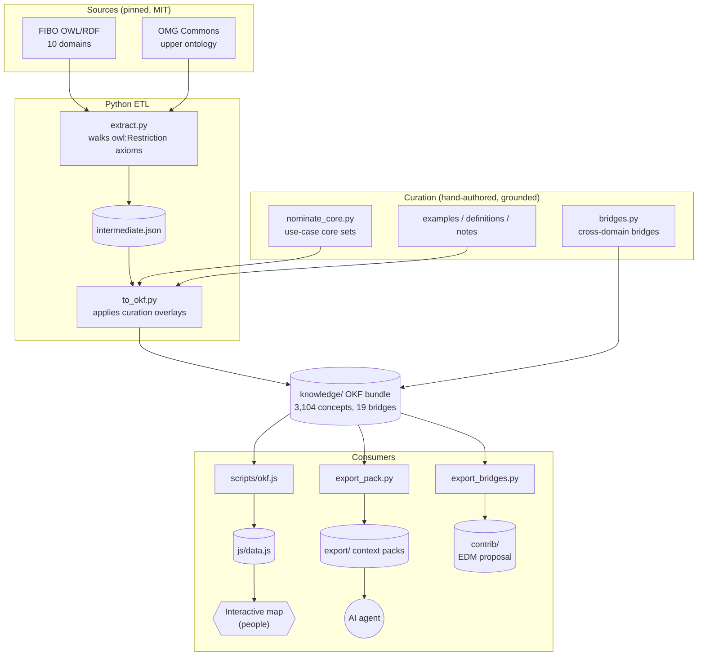
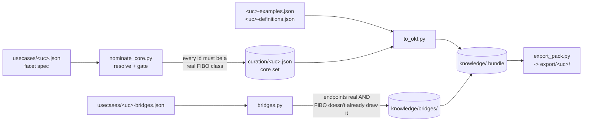
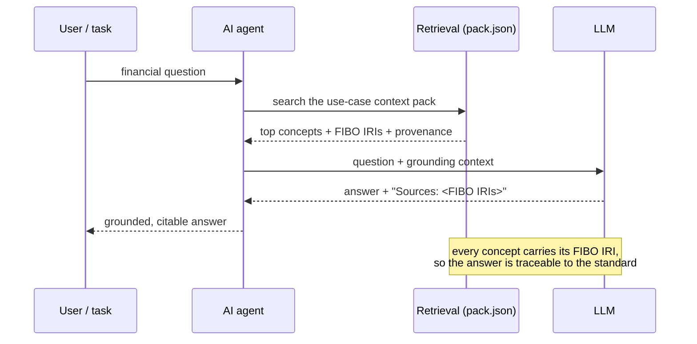
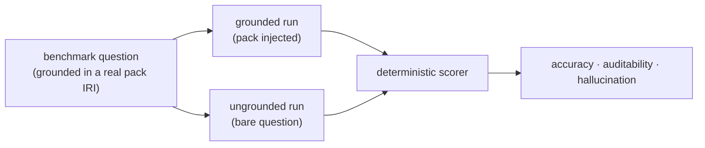

# Architecture

Two toolchains, one bundle in the middle. FIBO's OWL/RDF is turned into a clean OKF knowledge
bundle, which then feeds three consumers: the interactive map (for people), the context packs (for
AI agents), and the bridge contribution (for the EDM Council).

## System overview



Everything left of the bundle is **generated**; only the `curation/` overlays and
`knowledge/bridges/` are hand-authored. Extraction is deterministic, so the bundle reproduces
byte-for-byte.

## 1. Extract (`etl/extract.py`)

FIBO ships as OWL/RDF where the interesting relationships hide inside `owl:Restriction` blank-node
axioms on `rdfs:subClassOf`, not as flat triples. `extract.py` walks those into a flat
`out/intermediate.json`. `fibo_ns.py` classifies every IRI into a cluster (FIBO domain / `CMNS` /
`LCC`) and maps it to a stable path.

## 2. Build the OKF bundle (`etl/to_okf.py`)

One markdown file per concept, with YAML frontmatter:

```yaml
type: FIBO Class
title: "bond"
description: "tradable debt instrument representing a loan..."   # from FIBO skos:definition
resource: https://spec.edmcouncil.org/fibo/ontology/SEC/Debt/Bonds/Bond   # the audit citation
tags: [SEC, Release]
core: true
use_cases: ["Securities Instruments & Issuance (capital markets)"]
relations:
  - {type: is-a, target: "/FBC/.../DebtInstrument", provenance: fibo}
  - {type: backed-by, target: "/LOAN/.../Mortgage", provenance: curated}   # a bridge
```

## 3. Curation and use cases

A use case is spec-driven. Dropping a spec under `curation/usecases/` adds one, no code change:



Five use cases are curated this way (loan origination, KYC, securities, regulatory reporting,
derivatives): **284 core concepts, 19 validated cross-domain bridges**. The `nominate_core` and
`bridges` steps are **anti-hallucination gates**: they exit non-zero if any id or bridge endpoint
isn't a real FIBO class, so a use case can never reference a concept that doesn't exist.

## 4. The map (`scripts/okf.js` + `okf.config.js` + `js/`)

`okf.config.js` holds everything that isn't a concept: the domains (split into module sub-clusters),
maturity levels, relation styling (curated bridges drawn distinctly), and the interactive flows.
`scripts/okf.js build` emits `js/data.js`. `js/graph.js` (forked from Bodhi) renders it with
Cytoscape + fcose; the CSS is byte-identical to Bodhi. The default view lays out only the visible
core, so load stays fast even on the full 3,104-node ontology, and a use-case lens focuses one use
case at a time.

## 5. Agent grounding at runtime

This is the product: an agent answers a financial question grounded in the pack, and every answer
carries a checkable FIBO citation.



`etl/export_pack.py` emits each use case's grounding closure as `pack.json` (RAG records),
`context.md` (prompt injection), and an OKF slice. `etl/retrieval.py` + `etl/mcp_server.py` expose
it as an MCP retrieval endpoint.

## 6. The eval (`eval/`) — grounded vs ungrounded

The value proof runs the same agent twice and scores the difference deterministically (no LLM
judge):



Result across **209 questions in four domains, on gpt-4o-mini (corroborated on gpt-4o)**: a
**+44.5-point aggregate accuracy lift, 96.2% auditable, 0% grounded hallucination**. See
**[Value Proof](Value-Proof)**.

## Provenance model

Provenance is never blurred. Every relation and every overlaid field is tagged `fibo` (from FIBO)
or `curated` (authored here). Overlays only fill gaps; they never overwrite real FIBO text. This is
what makes an answer auditable and what keeps the EDM Council contribution honest.

The fuller repo-side version is in
[docs/Architecture.md](https://github.com/AI-First-Community/Bodhi-Map-For-FinTech/blob/main/docs/Architecture.md).
